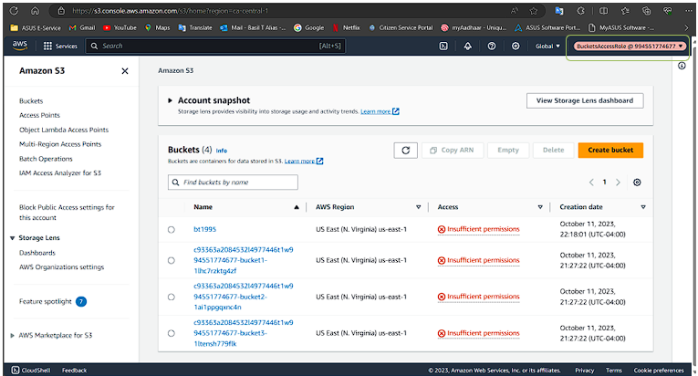

# 🔐 AWS IAM & S3 Bucket Security Lab

This project explores **AWS Identity and Access Management (IAM)** and **resource-based policies** for securing **Amazon S3 buckets**. The lab demonstrates how IAM users, groups, policies, and roles interact with resource-based policies to control access to AWS resources.  

---

## 🚀 Objectives
- Configure **IAM users, groups, and identity-based policies**.
- Explore **read-level vs. write-level access** to AWS services (EC2 & S3).
- Analyze **identity-based IAM policies** attached to groups.
- Test **role assumption** with `BucketsAccessRole` and `OtherBucketAccessRole`.
- Understand **resource-based policies** applied to S3 buckets.
- Demonstrate the **principle of least privilege** in action.

---

## 🛠️ Lab Environment
- **AWS Academy Learner Lab**  
- IAM user: `devuser` (member of `DeveloperGroup`)  
- IAM Policies: `DeveloperGroupPolicy`, `ListAllBucketsPolicy`, `GrantBucket1Access`  
- Roles: `BucketsAccessRole`, `OtherBucketAccessRole`  
- Services: **Amazon S3, EC2, IAM**  

---

## ⚙️ Tasks & Highlights

### 1️⃣ Accessing the Console as IAM User
- Logged in as **devuser** with restricted access.
    
📸 Screenshot:  

---

### 2️⃣ Read-Level Access to AWS Services
- Tried **launching EC2** → Access denied.  
- Explored **S3 buckets** → Read access available.
  
📸 Screenshot:

---

### 3️⃣ Analyzing IAM Policy
- `DeveloperGroupPolicy` allowed S3 actions like **CreateBucket**, **ListAllMyBuckets**, but **no EC2 permissions**.  
- Upload (`s3:PutObject`) was not permitted.
  
📸 Screenshot:  

#### Permissions for EC2
- There are no specific EC2 actions listed in this policy

#### Permissions  for S3
-	"Action": "s3:CreateBucket" - This allows creating S3 buckets.
-	"Action": "s3:ListAllMyBuckets" - This permit listing all S3 buckets owned by the user.
-	"Action": "s3:ListBucket" - This allows listing the objects in an S3 bucket.
-	"Action": "s3:PutAccountPublicAccessBlock" - This permit configuring public access settings for the AWS account.
-	"Action": "s3:PutBucketOwnershipControls" - This action allows configuring ownership controls for S3 buckets.
-	"Action": "s3:PutBucketPublicAccessBlock" - This action allows configuring public access settings for an S3 bucket.
-	"Resource": "*" - indicates that these actions apply to all S3 resources (buckets and objects).

---

### 4️⃣ Write-Level Access
- Successfully **created a new S3 bucket**.  
- **Upload failed** because `s3:PutObject` was not included in policy.
  
📸 Screenshot:  

---

### 5️⃣ Assuming IAM Role
- Switched from **devuser → BucketsAccessRole**.  
- Gained **read/write access** to `bucket1` and `bucket2`.
  
📸 Screenshot:  

---

### 6️⃣ Resource-Based Policies
- Examined **bucket2 policy**:  
  - Allowed `BucketsAccessRole` → `s3:GetObject`, `s3:PutObject`, `s3:ListBucket`.  
- Demonstrated how **resource-based + role-based policies combine** to grant access.
  
📸 Screenshot:  

---

## 📌 Key Learnings
- IAM **identity-based policies** define user/group permissions.  
- **Resource-based policies** add flexibility by granting cross-account or role-specific access.  
- Roles like **BucketsAccessRole** extend privileges beyond the base IAM user.  
- Missing fine-grained permissions (e.g., `s3:PutObject`) directly restrict functionality.  
- Combining **least privilege + RBAC** ensures secure AWS environments.  

---

